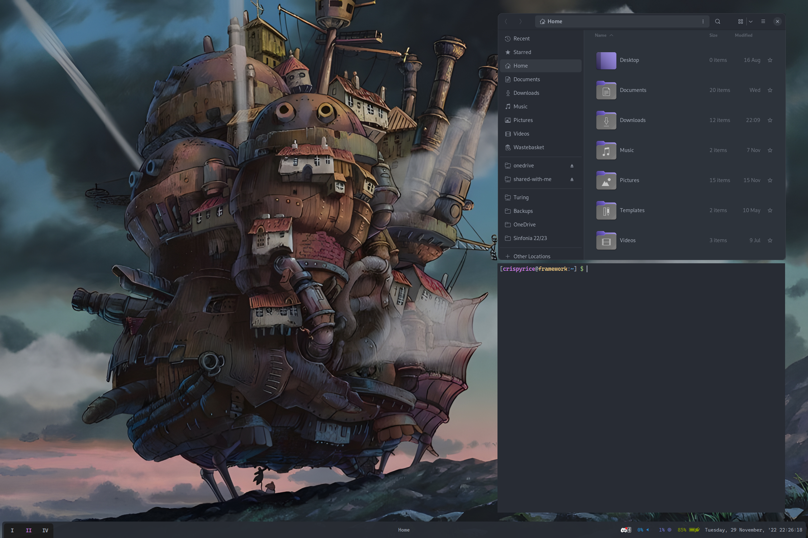

# [crispyricepc/dotfiles](https://github.com/crispyricepc/dotfiles)

These dotfiles contain configs for multiple window managers, by virtue of being an Nvidia wayland user, thus my sway config occasionally breaks without warning

Use `./install.sh` to check for any dependencies needed, and symlink all the relevant files to your home directory locations

You can run the install script without installing one or more dependencies. It only checks in order to let you know what features you shouldn't expect to work

